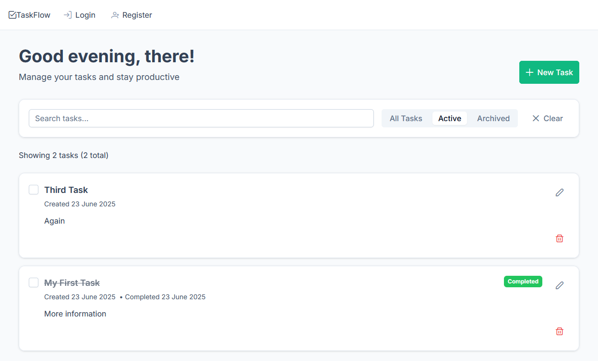

# Task Management SPA

A modern, accessible, and responsive Task Management Single Page Application (SPA) built with Vue 3, TypeScript, PrimeVue, Pinia, and TanStack Query. The app allows users to register, log in, and manage personal tasks with full CRUD (Create, Read, Update, Delete) and archiving capabilities.

## Features
- User registration, login, and profile management
- Persistent authentication with JWT
- Task CRUD: create, read, update, delete, and archive tasks
- Search and filter tasks by name, description, and archived status
- Optimistic UI updates for task actions
- Accessible and responsive design (WCAG 2.1 AA)
- Toast notifications for success and error events
- Loading and empty states for all views
- Robust error handling and state management



## Tech Stack
- [Vue 3](https://vuejs.org/) + [TypeScript](https://www.typescriptlang.org/)
- [PrimeVue](https://www.primefaces.org/primevue/) UI library
- [Pinia](https://pinia.vuejs.org/) for global state
- [TanStack Query (Vue Query)](https://tanstack.com/query/latest/docs/framework/vue/overview) for server state
- [Axios](https://axios-http.com/) for API requests
- [Vite](https://vitejs.dev/) for development/build
- [Vitest](https://vitest.dev/) and [Vue Test Utils](https://test-utils.vuejs.org/) for testing

## Prerequisites
- [Node.js](https://nodejs.org/) (v18+ recommended)
- [npm](https://www.npmjs.com/) or [yarn](https://yarnpkg.com/)
- The backend API running locally (see below)

## Getting Started

### 1. Clone the Repositories

```sh
git clone https://github.com/alexisbmills/vibe-coding-tasks-api.git
# (in a separate folder)
git clone https://github.com/alexisbmills/vibe-coding-tasks-vue.git
```

### 2. Start the Backend API

Follow the instructions in the [vibe-coding-tasks-api](https://github.com/alexisbmills/vibe-coding-tasks-api) README to install dependencies and run the backend server locally (default: `http://localhost:5000`).

### 3. Install Frontend Dependencies

```sh
cd vue-task-ui
npm install
```

### 4. Configure Environment (Optional)

If your backend API is not running on `http://localhost:5000`, create a `.env` file and set:

```
VITE_API_BASE_URL=http://your-api-url:port
```

### 5. Run the App

```sh
npm run dev
```

The app will be available at [http://localhost:5173](http://localhost:5173) by default.

## Running Tests

```sh
npm run test
```

## Project Structure
- `src/components/` — Reusable UI components
- `src/views/` — Top-level route views
- `src/composables/` — Reusable logic (e.g., useAuth, useTasks)
- `src/services/` — API client and integrations
- `src/stores/` — Pinia store modules
- `src/router/` — Vue Router configuration
- `src/types/` — TypeScript types

## Accessibility & Best Practices
- Fully keyboard navigable and screen reader friendly
- Uses semantic HTML and ARIA attributes
- Responsive design for all device sizes

## License
MIT
